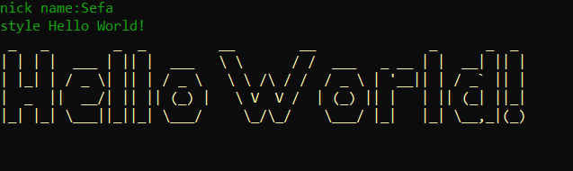
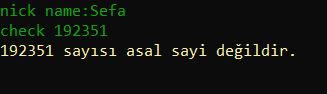
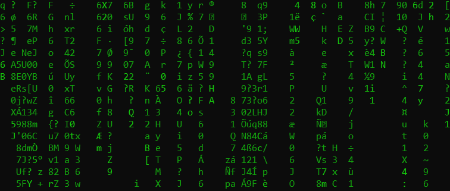
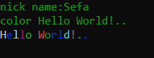

# Firebase - Console Chat App
> Birden çok kullanıcının aynı anda Firebase üzerinden konuştuğu konsol mesajlaşma uygulamasıdır.

## Komutlar

### Nick Komutu
`nick yeninick` komutu nick'inizi değiştirmenizi sağlar.
        
### Clear Komutu
`clear` komutu konsolda var olan yazıların hepsini tüm kullanıcılarda siler.  
 
### Style Komutu
Bu komut ise `style msj` şeklinde kullanılır.

          

### Check Komutu
`check sayi` komutu konsola yazdığınız bir sayıyı asal olup olmadığını kontrol eder.

    

### Play Komutu
`play` komutu sistemde var olan ses kayıtlarını bütün kullanıcılarda çalar. 

Bazı play komutları;
> - play 0, Yürütülen ses kaydını kapatır.
> - play 1
> - play 2
> - play 3
> - play 4
> - play 5
> - play 6
> - play 7
> - play 8
> - play 9
> - play 10...

### Open Komutu
Bu komutu kullandığınızda serverde bulunan bütün kişilerde aynı url açılır.
> open github.com/sefakozan

### Matrix Komutu
Bu komut konsola `matrix` yazıldığında serverde olan bütün kullanıcılarda matrix açılır.  
Kullanıcıların matrix'i kapatması için `Enter` tuşuna basması gerekir.
> matrix

### Color Komutu
`color metin` color yazısından sonra gelen yazıyı(metin) renkli yazar.
> color Hello World!..
> 

### Shake Komutu
 `shake` komutu serverde olan kişilerin hepsinin konsolu sallanır.

### asd Komutu
`asd` komutu size soğuk bir espri yapar.
> - asd 1
> - asd 2
> - asd 3
> - asd 4
> - asd 5...

